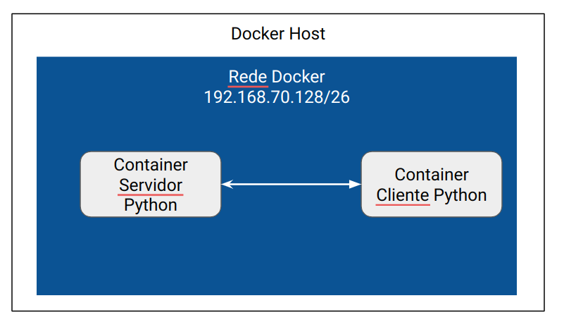

# Docker

Mesma arquitetura cliente-servidor da pasta [`Cliente-Servidor/TCP`](../Cliente-Servidor/TCP), mas rodando em containers Docker conectados a uma rede virtual isolada (subnet `192.168.70.128/26`), simulando dois hosts distintos se comunicando pela rede.

## Arquitetura

- **Servidor** (`192.168.70.131`): container `servidor`, criado a partir da imagem `server:latest` (`Dockerfile.server`), conectado à rede `reder-docker-exemplo`.
- **Cliente** (`192.168.70.135`, e opcionalmente `.136` / `.137` via Compose): container(s) `cliente`, criado(s) a partir da imagem `cliente:latest` (`Dockerfile.client`), na mesma rede.

A imagem abaixo ilustra a disposição da arquitetura cliente-servidor:



## Arquivos

### `server.py`
Servidor TCP (equivalente ao `servidor-thread.py` de `Cliente-Servidor/TCP`, adaptado ao IP fixo do container):
- Faz *bind* em `192.168.70.131:1234` e escuta conexões.
- Aceita até 10 conexões, atendendo cada uma em uma `Thread` separada.
- Cada thread recebe até 4 mensagens do cliente, respondendo `Hey cliente!` a cada uma, e fecha a conexão ao final.

### `client.py`
Cliente TCP que se conecta a `192.168.70.131:1234` e envia 4 mensagens (`requisicao 0` a `requisicao 3`), imprimindo a resposta do servidor a cada envio.

### `Dockerfile.server` / `Dockerfile.client`
Imagens baseadas em `ubuntu:latest`: instalam Python 3 e pip, instalam as dependências de `requirements.txt` e copiam, respectivamente, `server.py` ou `client.py` para dentro da imagem, executando o script como comando padrão do container.

### `requirements.txt`
Dependências Python instaladas nas imagens (`pandas`, `numpy`).

### `aplication.yaml`
Arquivo do Docker Compose que define os serviços `servidor`, `cliente`, `cliente1` e `cliente2`, cada um com IP fixo na rede `reder-docker-exemplo` (subnet `192.168.70.128/26`), permitindo subir toda a arquitetura com um único comando.

## Como executar

### Utilizando Docker Run

```bash
docker build -t server:latest -f Dockerfile.server .
docker build -t cliente:latest -f Dockerfile.client .
docker network create --subnet=192.168.70.128/26 reder-docker-exemplo
docker run -it --name servidor --net reder-docker-exemplo --ip 192.168.70.131 server:latest 
docker run --name cliente --net reder-docker-exemplo --ip 192.168.70.135 cliente:latest
```

### Utilizando o Docker Compose

```bash
docker-compose -f aplication.yaml up server
docker-compose -f aplication.yaml up
```

### Redirecionamento NAT

```
sudo iptables -t nat -A PREROUTING -p tcp --dport 80 -j REDIRECT --to-port 9999
sudo iptables -t nat -L --line-numbers
sudo iptables -t nat -D PREROUTING 2
```

### DNS
```
sudo vim /etc/hosts
192.34.1.9 mksb.server
nslookup mksb.server
```

### Rota Estatica

```
sudo ip route add <rede_alvo> via <next_hop> dev <interface_local_de_saída>
#comandos aplicados no host de origem e destigo
sudo sysctl net.ipv4.conf.all.forwarding=1
sudo iptables -P FORWARD ACCEPT
```
